# RFID Asset Management System

以 RFID 設備盤點為應用場景的 Flutter Side Project，完整實作 Kotlin 原生整合、狀態管理、本地資料庫與 CI/CD 流程，架構與真實專案一致。

---

## Screenshots

<table>
  <tr>
    <td align="center"><b>首頁</b></td>
    <td align="center"><b>配對裝置</b></td>
    <td align="center"><b>掃描</b></td>
  </tr>
  <tr>
    <td>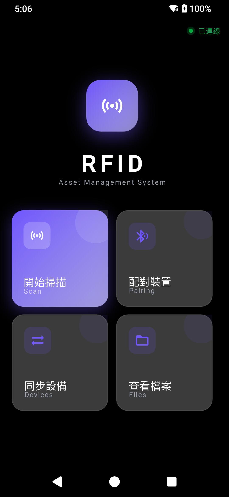</td>
    <td>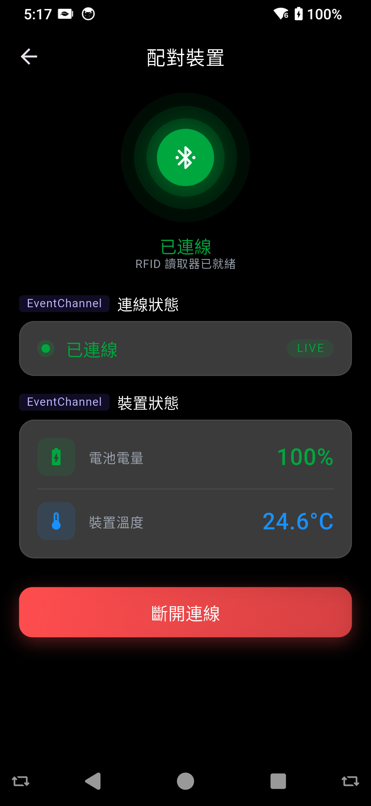</td>
    <td>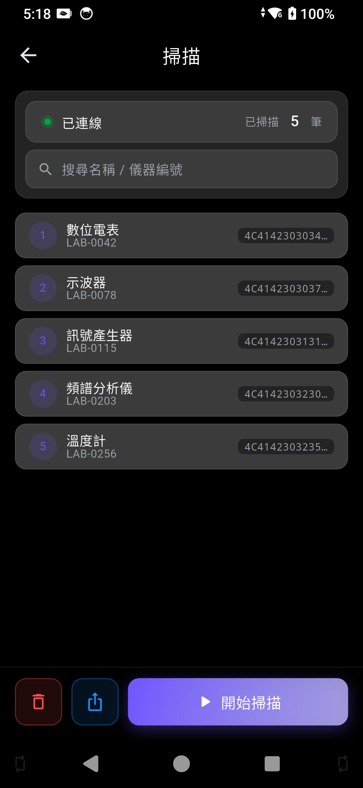</td>
  </tr>
  <tr>
    <td align="center"><b>同步設備</b></td>
    <td align="center"><b>查看檔案</b></td>
  </tr>
  <tr>
    <td>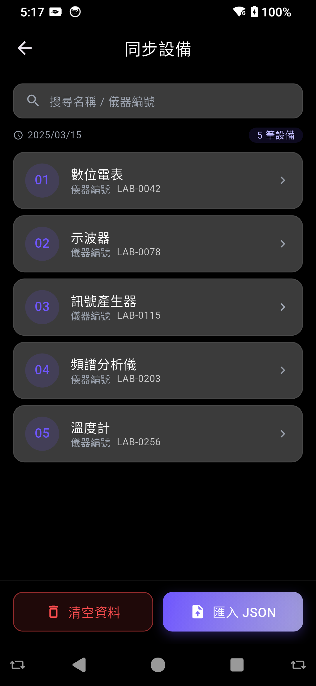</td>
    <td>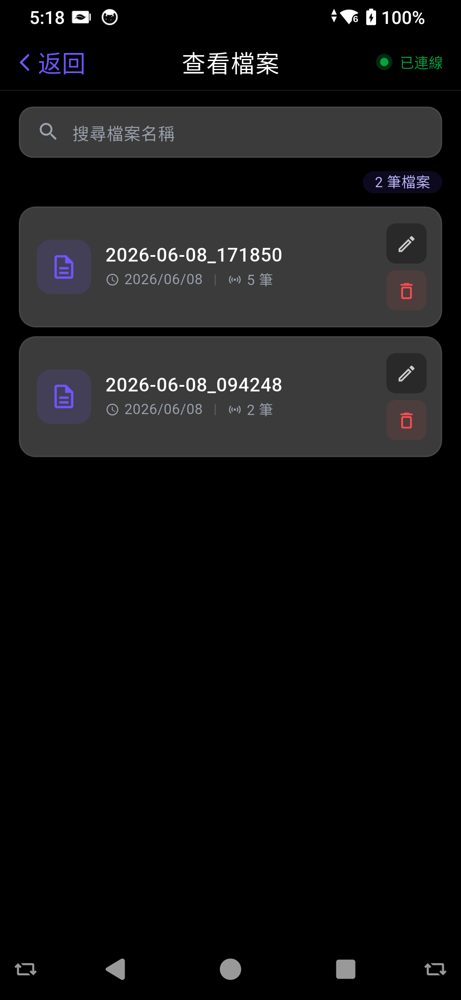</td>
  </tr>
</table>

---

## Tech Stack

| 分類 | 技術 |
|------|------|
| Framework | Flutter 3.x / Dart |
| Native 整合 | Kotlin · MethodChannel · EventChannel |
| 狀態管理 | Riverpod 3 |
| 本地資料庫 | Drift (SQLite) |
| 推播通知 | Firebase Cloud Messaging (FCM) |
| 錯誤追蹤 | Firebase Crashlytics |
| 響應式尺寸 | flutter_screenutil |
| CI/CD | GitHub Actions + Firebase App Distribution |
| 多環境 | Build Flavor (dev / prod) |

---

## Architecture

```
lib/
├── core/            # 共用常數、工具
├── data/
│   ├── database/    # Drift schema & generated code
│   ├── models/      # 資料模型
│   ├── repositories/# 資料存取層
│   └── services/    # 業務邏輯服務
├── pages/           # UI 頁面
├── providers/       # Riverpod providers
├── services/        # App 層服務（FCM 等）
├── viewmodels/      # ViewModel（Riverpod Notifier）
└── widgets/         # 共用元件

android/
└── app/src/main/kotlin/
    └── rfid/
        ├── MainActivity.kt
        ├── RfidPlugin.kt        # MethodChannel / EventChannel 路由
        ├── RfidController.kt    # 硬體指令封裝
        └── RfidEventListener.kt
```

**採用 MVVM + Repository Pattern**

依賴方向單向，每一層只認識自己的下一層：

```
DeviceListPage              ← 只管畫面，資料來自 ViewModel
  └─ DeviceListViewModel    ← 持有 UI state，需要資料就問 Repository
       └─ DeviceRepository  ← 唯一碰資料庫的地方
            └─ AppDatabase  ← Drift，底層 SQLite
```

- Page 透過 `ref.watch` 訂閱 ViewModel，state 變了自動重繪
- ViewModel 不知道資料存在哪，只管呼叫 Repository 拿結果
- Native 硬體事件透過 EventChannel 推進來，Page 不需要主動輪詢

---

## Native 整合（Kotlin · MethodChannel · EventChannel）

Flutter 與 Kotlin 之間透過兩種 Channel 溝通：

**MethodChannel** — Flutter 主動呼叫 Kotlin 的單次指令，用於連線、震動、警示音等操作：

| | 程式碼 |
|---|---|
| Dart | `await cmdChannel.invokeMethod<String>('connect');` |
| Kotlin | `"connect" -> rfidController.connect()` |

**EventChannel** — Kotlin 主動推資料給 Flutter 的持續串流，用於連線狀態、電池電量等即時資訊：

| | 程式碼 |
|---|---|
| Dart | `stateChannel.receiveBroadcastStream().map(...)` |
| Kotlin | `eventSink?.success("Connected")` |

Channel 名稱在兩側必須完全一致，任何一側改名都會導致 Silent Failure。

---

## 本地資料庫（Drift / SQLite）

以 Drift 定義 type-safe schema，`build_runner` 自動生成 DAO 與 Companion class：

```dart
@DataClassName('DeviceEntity')
class Devices extends Table {
  TextColumn get uid        => text()();
  TextColumn get serialCode => text()();
  TextColumn get label      => text()();
  TextColumn get registryId => text()();
  TextColumn get category   => text()();
  TextColumn get epc        => text()();

  @override
  Set<Column> get primaryKey => {uid};
}
```

欄位調整時 bump `schemaVersion` 並加 migration，不需手寫 SQL：

```dart
@override
int get schemaVersion => 2;

@override
MigrationStrategy get migration => MigrationStrategy(
  onUpgrade: (m, from, to) async {
    if (from < 2) {
      await m.drop(devices);
      await m.createTable(devices);
    }
  },
);
```

---

## CI/CD Pipeline

| 觸發條件 | 執行項目 |
|----------|----------|
| Pull Request | Analyze & Test |
| Merge to main | Analyze & Test → Build dev APK → Firebase App Distribution |
| Push tag `v*` | Analyze & Test → Build prod APK |

- PR 時只跑 Analyze & Test，main 受 Branch Protection 保護
- Merge 進 main 後自動 build dev APK 並部署到 Firebase App Distribution
- Production build 僅在 push tag 時觸發

<table>
  <tr>
    <td align="center"><b>GitHub Actions</b></td>
    <td align="center"><b>Pipeline 流程</b></td>
  </tr>
  <tr>
    <td>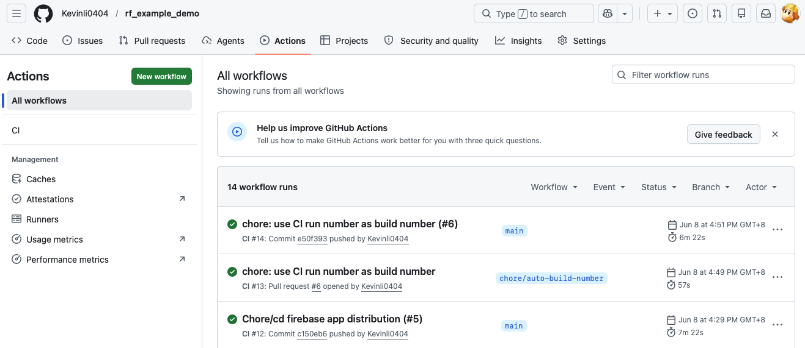</td>
    <td>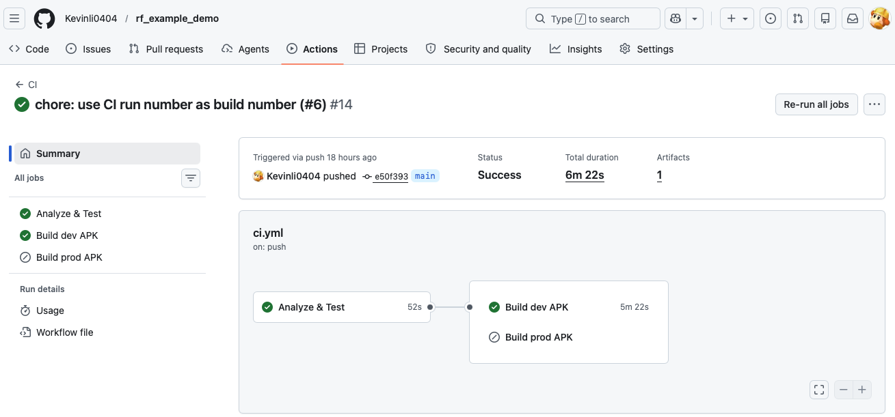</td>
  </tr>
  <tr>
    <td align="center"><b>PR 紀錄</b></td>
    <td align="center"><b>Firebase App Distribution</b></td>
  </tr>
  <tr>
    <td>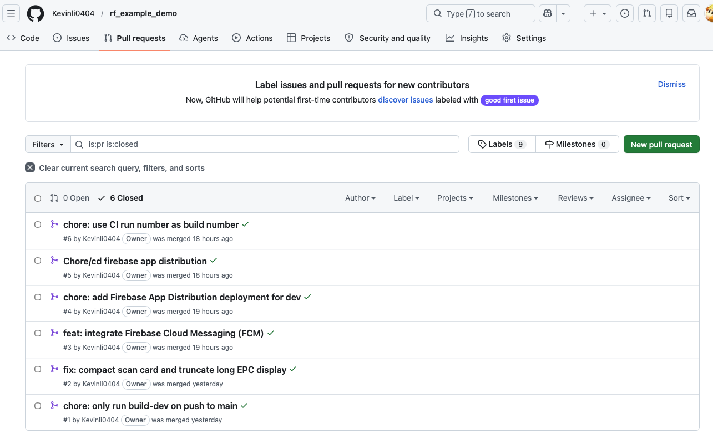</td>
    <td>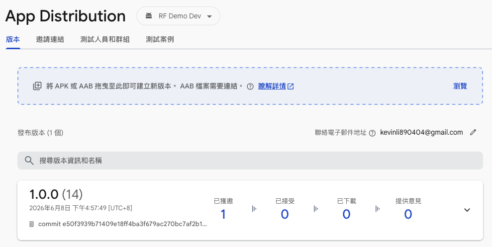</td>
  </tr>
</table>

---

## Key Features

- **RFID 掃描** — 連線後模擬真實硬體掃描流程，每筆 tag 透過 MethodChannel 觸發 Kotlin 原生震動回饋，並進行去重複邏輯
- **設備同步** — 從 JSON 匯入設備清單至本地 Drift 資料庫，支援搜尋與清空
- **掃描結果匯出** — 將掃描結果寫入外部儲存，支援自訂檔名與重新命名
- **FCM 推播** — 整合 Firebase Cloud Messaging，支援前景 banner 與背景系統通知，可透過 Firebase Console 對所有已安裝裝置發送推播

  <table>
    <tr>
      <td align="center"><b>背景系統通知</b></td>
      <td align="center"><b>Firebase Console</b></td>
    </tr>
    <tr>
      <td>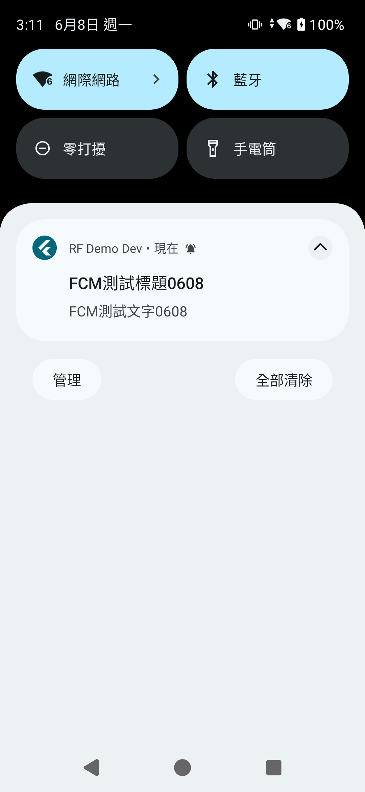</td>
      <td>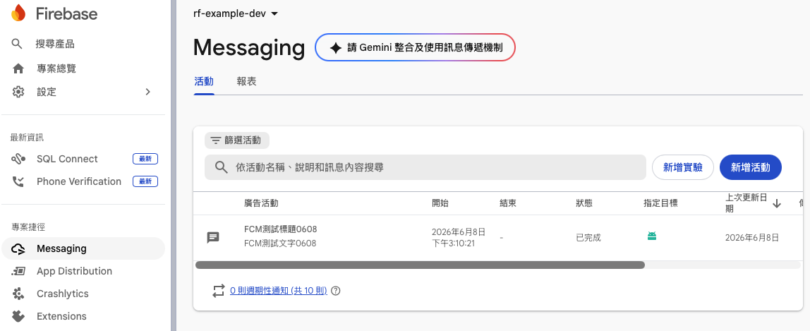</td>
    </tr>
  </table>
- **裝置狀態監測** — 真實 RFID 硬體需特定裝置才能運作，此專案改以 Android BatteryManager 定時輪詢電池電量與溫度，透過 EventChannel 推送至 Flutter，展示相同的原生串流整合架構
- **多環境建置** — dev / prod 兩套 Firebase 設定與 applicationId，Firebase Console 分專案管理

  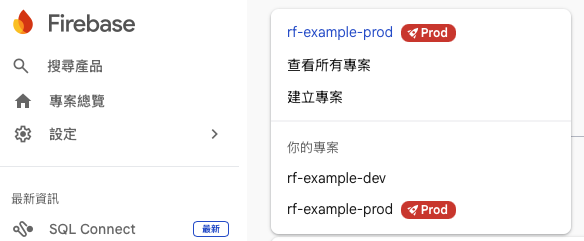

- **錯誤追蹤** — Firebase Crashlytics 整合，自動捕捉未處理例外並上報；截圖為開發期間手動觸發 crash 的測試紀錄，正式版本已移除該觸發入口

  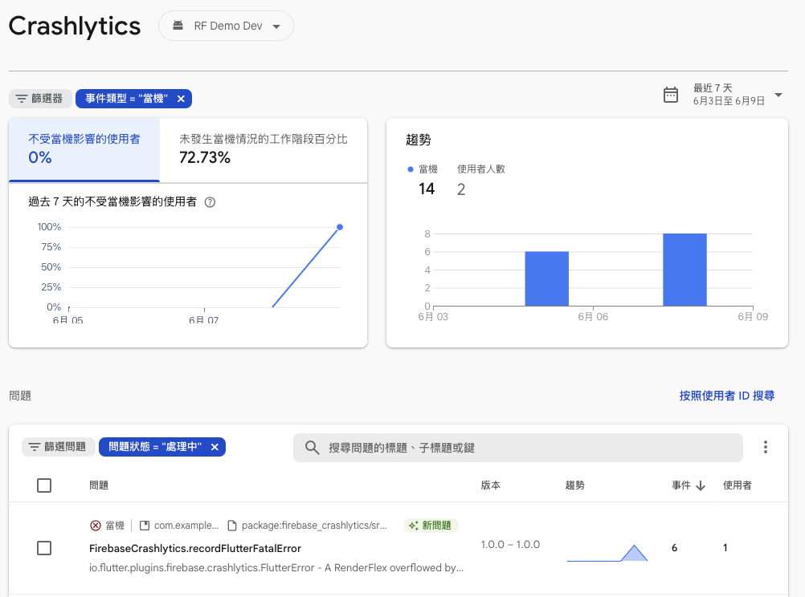

---

## Getting Started

**環境需求**
- Flutter SDK `>=3.10.0`
- Android SDK
- Firebase 專案（dev / prod 各一份 `google-services.json`）

**執行**

```bash
flutter run --flavor dev
flutter run --flavor prod
```

**測試**

```bash
flutter test
flutter analyze
```

---

## 範例資料

`assets/sample_export_0609.txt` 為範例設備清單，可直接匯入 app 測試同步功能。
